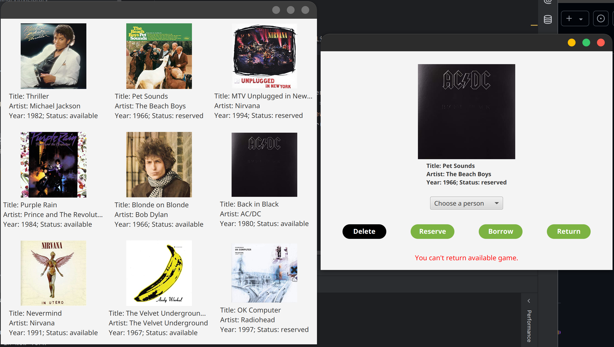

# Vinyl Library

The Vinyl Library project is a Java-based application designed to manage a collection of vinyl records. It utilizes the JavaFX framework for the graphical user interface and is built using Maven for dependency management and build automation.


## Features

- **Model-View-ViewModel (MVVM) Architecture**: The application follows the MVVM design pattern, ensuring a clear separation of concerns and facilitating easier maintenance and testing.
- **Vinyl Collection Management**: Users can manage their vinyl records, including adding, editing, and deleting records.
- **User Management**: The application supports managing user information, allowing for personalized experiences.
- **Simulation**: The application includes a simulation feature to demonstrate various actions and interactions within the vinyl library.

## Technologies Used

- **Java**: The primary programming language used for the application.
- **JavaFX**: Used for building the user interface.
- **Maven**: For project management and build automation.

## Getting Started

To run the application, ensure you have Java and Maven installed. Clone the repository and use Maven to build and run the project.

```sh
git clone git@github.com:Sevastian-Bahynskyi/VinylLibrary.git
cd VinylLibrary
mvn clean install
mvn javafx:run
```